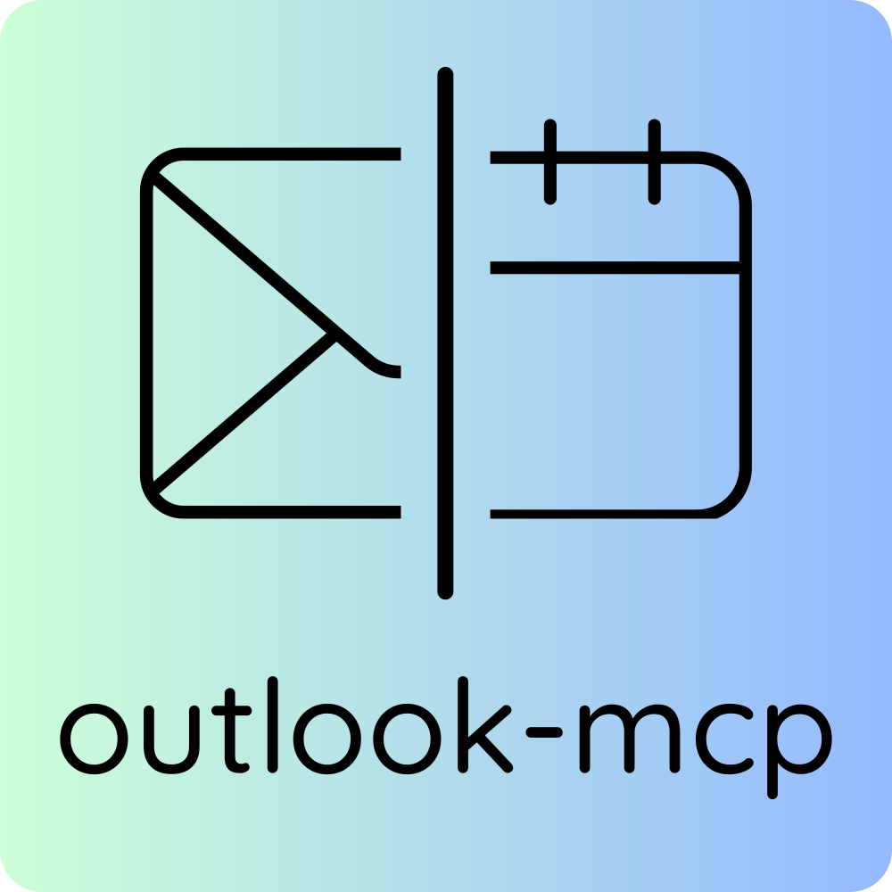

<p align="center">
  
</p>

<p align="center">
  <strong>Let your AI assistant read, search, send, and manage your Outlook email, calendar, and contacts — all from the conversation.</strong>
</p>

<p align="center">
  <a href="https://www.npmjs.com/package/@littlebearapps/outlook-mcp"></a>
  <a href="https://www.npmjs.com/package/@littlebearapps/outlook-mcp"></a>
  <a href="https://github.com/littlebearapps/outlook-mcp/actions/workflows/ci.yml"></a>
  <a href="LICENSE"></a>
  <a href="https://nodejs.org"></a>
</p>

Outlook MCP connects AI assistants to your Microsoft Outlook account through the [Model Context Protocol](https://modelcontextprotocol.io/). Ask your AI assistant to search your inbox, send emails, schedule meetings, manage contacts, and configure mailbox settings — without leaving the conversation. Works with Claude, Cursor, Windsurf, and any MCP-compatible client.

**Works with personal Outlook.com and work/school Microsoft 365 accounts.**

### What you can do

- **Search and read emails** — find messages by sender, subject, date, or keywords; read full threads with conversation grouping
- **Send emails with safety controls** — dry-run preview, session rate limiting, and recipient allowlist to prevent mistakes
- **Manage your calendar** — view upcoming events, schedule meetings with attendees, decline or cancel invitations
- **Export emails** — save to Markdown, EML, MBOX, JSON, or HTML for archiving, analysis, or migration
- **Investigate email headers** — check DKIM, SPF, and DMARC authentication; trace delivery chains; analyse spam scores
- **Organise your inbox** — create folders, set up inbox rules, colour-code with categories, manage Focused Inbox
- **Manage contacts** — search your contact book and organisational directory, create and update contact records
- **Configure settings** — set out-of-office auto-replies, working hours, and time zone
- **Access shared mailboxes** — read team inboxes and service accounts (Microsoft 365)
- **Find meeting rooms** — search by building, floor, or capacity (Microsoft 365)

### Why Outlook MCP?

| Without Outlook MCP | With Outlook MCP |
|---------------------|------------------|
| Switch between your AI tool and Outlook to manage email | Read, search, send, and export emails directly from your AI assistant |
| Manually search and export email threads | Full email tools including search, threading, and bulk export |
| Context-switch for calendar and contacts | Manage calendar events, contacts, and settings in one place |
| Copy-paste email content into conversations | Your AI assistant reads your emails natively with full context |
| No programmatic access to mailbox rules or categories | Create inbox rules, manage categories, configure auto-replies |

## Features

| Module | Tools | What You Can Do |
|--------|------:|-----------------|
| **Email** | 6 | `search-emails` (list/search/delta/conversations), `read-email` (content + forensic headers), `send-email` (with dry-run), `update-email` (read status, flags), `attachments`, `export` |
| **Calendar** | 3 | `list-events`, `create-event`, `manage-event` (decline/cancel/delete) |
| **Contacts** | 2 | `manage-contact` (list/search/get/create/update/delete), `search-people` |
| **Categories** | 3 | `manage-category` (CRUD), `apply-category`, `manage-focused-inbox` |
| **Settings** | 1 | `mailbox-settings` (get/set auto-replies/set working hours) |
| **Folder** | 1 | `folders` (list/create/move/stats/delete) |
| **Rules** | 1 | `manage-rules` (list/create/reorder/delete) |
| **Advanced** | 2 | `access-shared-mailbox`, `find-meeting-rooms` |
| **Auth** | 1 | `auth` (status/authenticate/about) |

**20 tools total** — consolidated from 55 for optimal AI performance. See the [Tools Reference](docs/quickrefs/tools-reference.md) for complete parameter details.

### Export Formats

| Format | Use Case |
|--------|----------|
| `mime` / `eml` | Full MIME with headers — archival and forensics |
| `mbox` | Unix MBOX archive — batch export conversations |
| `markdown` | Human-readable — paste into documents |
| `json` | Structured data — programmatic processing |
| `html` | Formatted — visual archival of threads |

## Account Compatibility

Outlook MCP works with both personal and work/school Microsoft accounts, but some features behave differently:

| Feature | Personal (Outlook.com) | Work/School (Microsoft 365) |
|---------|----------------------|---------------------------|
| Email read, send, search | Full support | Full support |
| Calendar events | Full support | Full support |
| Contacts CRUD | Full support | Full support |
| Inbox rules | Full support | Full support |
| Folders | Full support | Full support |
| Free-text `query` search | Limited — use `subject`, `from`, `to` filters instead | Full KQL support |
| Categories | Full support | Full support |
| Mailbox settings | Full support | Full support |
| Focused Inbox | Not available | Full support |
| Shared mailboxes | Not available | Requires `Mail.Read.Shared` |
| Meeting room search | Not available | Requires `Place.Read.All` + admin consent |

> **Note**: On personal accounts, the `query` and `kqlQuery` parameters in `search-emails` may silently return no results. Use structured filters (`from`, `subject`, `to`, `receivedAfter`) for reliable searching.

## Safety & Token Efficiency

Outlook MCP is designed with safety-first principles for AI-driven email access:

**Destructive action safeguards** — Every tool carries [MCP annotations](https://modelcontextprotocol.io/docs/concepts/tools#annotations) (`readOnlyHint`, `destructiveHint`, `idempotentHint`) so AI clients can auto-approve safe reads and prompt for confirmation on destructive operations like sending email or deleting events.

**Send-email protections** — The `send-email` tool includes:
- **Dry-run mode** (`dryRun: true`) — preview composed emails without sending
- **Session rate limiting** — configurable via `OUTLOOK_MAX_EMAILS_PER_SESSION` (default: unlimited)
- **Recipient allowlist** — restrict sending to approved addresses/domains via `OUTLOOK_ALLOWED_RECIPIENTS`

**Token-optimised architecture** — Tools are consolidated using the STRAP (Single Tool, Resource, Action Pattern) approach. 20 tools instead of 55 reduces per-turn overhead by ~11,000 tokens (~64%), keeping more of the AI's context window available for your actual conversation. Fewer tools also means the AI selects the right tool more accurately — research shows tool selection degrades beyond ~40 tools.

> **Important**: These safeguards are defence-in-depth measures that reduce risk, but they are not a guarantee against unintended actions. AI-driven access to your email is inherently sensitive — always review tool calls before approving, particularly for sends and deletes. No automated guardrail is foolproof, and you remain responsible for actions taken through your mailbox.

## Quick Start

### 1. Install

```bash
npm install -g @littlebearapps/outlook-mcp
```

Or run directly without installing:

```bash
npx @littlebearapps/outlook-mcp
```

### 2. Register an Azure App

You need a Microsoft Azure app registration to authenticate. See the **[Azure Setup Guide](docs/guides/azure-setup.md)** for a detailed walkthrough (including first-time Azure account creation), or if you've done this before:

1. Create a new app registration at [portal.azure.com](https://portal.azure.com/)
2. Set redirect URI to `http://localhost:3333/auth/callback`
3. Add Microsoft Graph delegated permissions (Mail, Calendar, Contacts)
4. Create a client secret and copy the **Value** (not the Secret ID)

### 3. Configure Your MCP Client

Add to your MCP client config. For Claude Desktop (`claude_desktop_config.json`):

```json
{
  "mcpServers": {
    "outlook": {
      "command": "npx",
      "args": ["@littlebearapps/outlook-mcp"],
      "env": {
        "OUTLOOK_CLIENT_ID": "your-application-client-id",
        "OUTLOOK_CLIENT_SECRET": "your-client-secret-VALUE"
      }
    }
  }
}
```

### 4. Authenticate

1. Start the auth server: `outlook-mcp-auth` (or `npx @littlebearapps/outlook-mcp-auth`)
2. In your AI assistant, use the `auth` tool with `action=authenticate` to get an OAuth URL
3. Open the URL, sign in with your Microsoft account, and grant permissions
4. Tokens are saved locally and refresh automatically

> **Note**: The auth server needs `OUTLOOK_CLIENT_ID` and `OUTLOOK_CLIENT_SECRET` environment variables. Your MCP client's `"env"` config only applies to the MCP server process — when running the auth server separately, ensure these are set in a `.env` file or exported in your shell.

## Installation

### Prerequisites

- **Node.js** 18.0.0 or higher
- **npm** (included with Node.js)
- **Azure account** for app registration ([free tier works](https://azure.microsoft.com/free/))

### From npm (recommended)

```bash
npm install -g @littlebearapps/outlook-mcp
```

### From source

```bash
git clone https://github.com/littlebearapps/outlook-mcp.git
cd outlook-mcp
npm install
```

## Azure App Registration

> **First time with Azure?** The [Azure Setup Guide](docs/guides/azure-setup.md) covers everything from creating an account to your first authentication, including billing setup and common pitfalls.

### Create the App

1. Open [Azure Portal](https://portal.azure.com/)
2. Sign in with a Microsoft Work or Personal account
3. Search for **App registrations** and click **New registration**
4. Enter a name (e.g. "Outlook MCP Server")
5. Select **Accounts in any organizational directory and personal Microsoft accounts**
6. Set redirect URI: platform **Web**, URI `http://localhost:3333/auth/callback`
7. Click **Register**
8. Copy the **Application (client) ID**

### Add Permissions

1. Go to **API permissions** > **Add a permission** > **Microsoft Graph** > **Delegated permissions**
2. Add these **required** permissions:
   - `offline_access` — refresh tokens between sessions
   - `User.Read` — basic profile
   - `Mail.Read`, `Mail.ReadWrite`, `Mail.Send` — email operations
   - `Calendars.Read`, `Calendars.ReadWrite` — calendar operations
   - `Contacts.Read`, `Contacts.ReadWrite` — contact management
   - `MailboxSettings.ReadWrite` — settings, auto-replies, categories
   - `People.Read` — people search
3. Optionally add **org-only** permissions (work/school accounts only):
   - `Mail.Read.Shared` — shared mailbox access
   - `Place.Read.All` — meeting room search (requires admin consent)
4. Click **Add permissions**

### Create a Client Secret

1. Go to **Certificates & secrets** > **New client secret**
2. Enter a description and select expiration
3. Click **Add**
4. **Copy the secret Value immediately** — you won't be able to see it again. Use the **Value**, not the Secret ID.

## Configuration

### Environment Variables

Create a `.env` file from the example:

```bash
cp .env.example .env
```

Edit with your Azure credentials:

```bash
OUTLOOK_CLIENT_ID=your-application-client-id
OUTLOOK_CLIENT_SECRET=your-client-secret-VALUE
USE_TEST_MODE=false
```

> **Note:** The server also accepts `MS_CLIENT_ID` and `MS_CLIENT_SECRET` for backwards compatibility.

### MCP Client Configuration

Add to your MCP client config (example for Claude Desktop):

```json
{
  "mcpServers": {
    "outlook": {
      "command": "npx",
      "args": ["@littlebearapps/outlook-mcp"],
      "env": {
        "OUTLOOK_CLIENT_ID": "your-application-client-id",
        "OUTLOOK_CLIENT_SECRET": "your-client-secret-VALUE"
      }
    }
  }
}
```

Or if installed from source:

```json
{
  "mcpServers": {
    "outlook": {
      "command": "node",
      "args": ["/path/to/outlook-mcp/index.js"],
      "env": {
        "OUTLOOK_CLIENT_ID": "your-application-client-id",
        "OUTLOOK_CLIENT_SECRET": "your-client-secret-VALUE"
      }
    }
  }
}
```

## Authentication Flow

### Step 1: Start the Auth Server

```bash
npm run auth-server
```

This starts a local server on port 3333 to handle the OAuth callback.

> **Note**: The auth server reads `OUTLOOK_CLIENT_ID` and `OUTLOOK_CLIENT_SECRET` from environment variables (or `MS_CLIENT_ID`/`MS_CLIENT_SECRET`). When running the auth server separately, ensure your `.env` file is in the project root or export the variables in your shell. Your MCP client's `"env"` config only applies to the MCP server process, not a separately-started auth server.

### Step 2: Authenticate

1. In your AI assistant, use the `auth` tool with `action=authenticate`
2. Open the provided URL in your browser
3. Sign in with your Microsoft account and grant permissions
4. Tokens are saved to `~/.outlook-mcp-tokens.json` and refresh automatically

## Directory Structure

```
outlook-mcp/
├── index.js                 # Main entry point (20 tools)
├── config.js                # Configuration settings
├── outlook-auth-server.js   # OAuth server (port 3333)
├── auth/                    # Authentication module (1 tool)
├── email/                   # Email module (6 tools)
│   ├── headers.js           # Email header retrieval
│   ├── mime.js              # Raw MIME/EML content
│   ├── conversations.js     # Thread listing/export
│   ├── attachments.js       # Attachment operations
│   └── ...
├── calendar/                # Calendar module (3 tools)
├── contacts/                # Contacts module (2 tools)
├── categories/              # Categories module (3 tools)
├── settings/                # Settings module (1 tool)
├── folder/                  # Folder module (1 tool)
├── rules/                   # Rules module (1 tool)
├── advanced/                # Advanced module (2 tools)
└── utils/
    ├── graph-api.js         # Microsoft Graph API client
    ├── safety.js            # Rate limiting, recipient allowlist, dry-run
    ├── odata-helpers.js     # OData query building
    ├── field-presets.js     # Token-efficient field selections
    ├── response-formatter.js # Verbosity levels
    └── mock-data.js         # Test mode data
```

## Troubleshooting

### "Cannot find module '@modelcontextprotocol/sdk/server/index.js'"

```bash
npm install
```

### "EADDRINUSE: address already in use :::3333"

```bash
npx kill-port 3333
npm run auth-server
```

### "Invalid client secret" (AADSTS7000215)

You're using the Secret **ID** instead of the Secret **Value**. Go to Azure Portal > Certificates & secrets and copy the **Value** column.

### Authentication URL doesn't work

Start the auth server first: `npm run auth-server`

### Empty API responses

Check authentication status with the `auth` tool (action=status). Tokens may have expired — re-authenticate if needed.

## Development

### Running Tests

```bash
npm test                     # Jest unit tests
npm run inspect              # MCP Inspector (interactive)
```

### Test Mode

Run with mock data (no real API calls):

```bash
USE_TEST_MODE=true npm start
```

### Extending the Server

1. Create a new module directory (e.g. `tasks/`)
2. Implement tool handlers in separate files
3. Export tool definitions from the module's `index.js`
4. Import and add tools to the `TOOLS` array in main `index.js`
5. Add tests in `test/`
6. Update `docs/quickrefs/tools-reference.md`

## Documentation

| Guide | Description |
|-------|-------------|
| [Getting Started](docs/how-to/getting-started/connect-outlook-to-claude.md) | Install, configure, and authenticate — start here |
| [Azure Setup Guide](docs/guides/azure-setup.md) | Azure account creation, app registration, permissions, and secrets |
| [How-To Guides](docs/how-to/index.md) | 25 practical guides for email, calendar, contacts, and settings |
| [Troubleshooting & FAQ](docs/how-to/getting-started/verify-your-connection.md#common-connection-problems) | Common problems, re-authentication, and frequently asked questions |
| [Tools Reference](docs/quickrefs/tools-reference.md) | All 20 tools with parameters |
| [AI Agent Guide](docs/how-to/ai-agents/using-outlook-mcp-in-agents.md) | Tool selection and workflow patterns for AI agents |

Full documentation: [docs/](docs/README.md)

## Known Limitations

- **Personal account search**: Free-text `query` and `kqlQuery` parameters may not work on personal Outlook.com accounts (Microsoft's `$search` API limitation). Use structured filters (`from`, `subject`, `to`, `receivedAfter`) instead.
- **Focused Inbox**: Only available on work/school Microsoft 365 accounts.
- **Shared mailboxes**: Require `Mail.Read.Shared` permission and a work/school account.
- **Meeting room search**: Requires `Place.Read.All` permission with admin consent (work/school accounts only).
- **Export default path**: Exports save to the system temp directory by default. Use `savePath` or `outputDir` to specify a different location.

## Contributing

Contributions are welcome! Please see [CONTRIBUTING.md](CONTRIBUTING.md) for guidelines.

## Security

For security concerns, please see our [Security Policy](SECURITY.md). Do not open public issues for vulnerabilities.

## Changelog

See [CHANGELOG.md](CHANGELOG.md) for version history.

## About

Built and maintained by [Little Bear Apps](https://littlebearapps.com). Outlook MCP is open source under the [MIT License](LICENSE).
